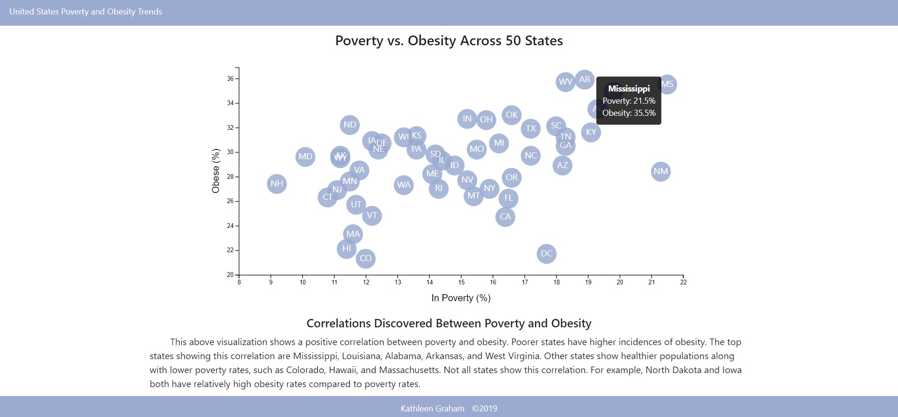

# Interactive Visualizations with D3.js

## Current Result


## Description

### Set Up

First, I organized my files and got my data.

### HTML

Next, I moved on to the basic index.html skeleton with navbar to hold my visualization.

```html
<!DOCTYPE html>
<html lang='en'>
<head>
  <meta charset='UTF-8'>
  <meta name='viewport' content='width=device-width, initial-scale=1.0'>
  <meta http-equiv='X-UA-Compatible' content='ie=edge'>
  <title>D3 Visualizations</title>
  <script src='https://code.jquery.com/jquery-3.3.1.slim.min.js' integrity='sha384-q8i/X+965DzO0rT7abK41JStQIAqVgRVzpbzo5smXKp4YfRvH+8abtTE1Pi6jizo'
    crossorigin='anonymous'></script>
  <script src='https://cdnjs.cloudflare.com/ajax/libs/popper.js/1.14.3/umd/popper.min.js' integrity='sha384-ZMP7rVo3mIykV+2+9J3UJ46jBk0WLaUAdn689aCwoqbBJiSnjAK/l8WvCWPIPm49'
    crossorigin='anonymous'></script>
  <script src='https://stackpath.bootstrapcdn.com/bootstrap/4.1.3/js/bootstrap.min.js' integrity='sha384-ChfqqxuZUCnJSK3+MXmPNIyE6ZbWh2IMqE241rYiqJxyMiZ6OW/JmZQ5stwEULTy'
    crossorigin='anonymous'></script>
  <link rel='stylesheet' href='https://stackpath.bootstrapcdn.com/bootstrap/4.1.3/css/bootstrap.min.css' integrity='sha384-MCw98/SFnGE8fJT3GXwEOngsV7Zt27NXFoaoApmYm81iuXoPkFOJwJ8ERdknLPMO'
    crossorigin='anonymous'>
  <link rel='stylesheet' href='assets/css/style.css'>
  <link rel='stylesheet' href='assets/css/d3Style.css'>

</head>

<body>

  <nav class='navbar navbar-custom'>
    <a class='navbar-brand' href='index.html'>United States Poverty and Obesity Trends</a>
    </div>
  </nav>

  <div class='container-fluid'>

    <div class='row'>
      <div class='col text-center'>
        <h4 id='plot-title'>Poverty vs. Obesity Across 50 States</h4>
      </div>
    </div>

    <div class='row'>
      <div class='col text-center'>
        <div id='scatter'>
        </div>
      </div>
    </div>

    <div class='row justify-content-center'>
      <div class='col-md-8'>

        <div class='row justify-content-center'>
          <h5 id='caption'>Correlations Discovered Between Poverty and Obesity</h5>
        </div>
        <div class='row'><p>&nbsp;&nbsp;&nbsp;&nbsp;&nbsp;&nbsp;&nbsp;&nbsp;This above visualization shows a positive correlation between poverty and obesity.
            Poorer states have higher incidences of obesity. The top states showing this correlation are
            Mississippi, Louisiana, Alabama, Arkansas, and West Virginia. Other states show healthier populations
            along with lower poverty rates, such as Colorado, Hawaii, and Massachusetts. Not all states show this
            correlation. For example, North Dakota and Iowa both have relatively high obesity rates compared to
            poverty rates.
          </p>
        </div>

      </div>
    </div>

  </div>

  <footer><p>Kathleen Graham &nbsp;&nbsp;&copy;2019</p></footer>

  <script src='https://cdnjs.cloudflare.com/ajax/libs/d3/5.5.0/d3.min.js'></script>
  <script src='https://cdnjs.cloudflare.com/ajax/libs/d3-tip/0.9.1/d3-tip.js'></script>
  <script type='text/javascript' src='assets/js/app.js'></script>

</body>

</html>
```


### D3.js

Then, I used d3.js to make an interactive visualization that would be rendered on my website using the local server.

```javascript
// canvas and svg width, height, and margins
const svgWidth = 900
const svgHeight = 450
const margin = {
    top: 25,
    right: 50,
    bottom: 50,
    left: 90
  }
const width = svgWidth - margin.left - margin.right
const height = svgHeight - margin.top - margin.bottom

// canvas
const svg = d3.select('#scatter').append('svg').attr('width', svgWidth).attr('height',svgHeight)

// chartGroup
const chartGroup = svg.append('g').attr('transform', `translate(${margin.left}, ${margin.top})`)

// data
const dataFile = 'assets/data/data.csv'
d3.csv(dataFile).then(visualization)

// plot function
function visualization(states) {
  
  // data loop
  states.map(function (data) {
    data.poverty = +data.poverty
    data.obesity = +data.obesity
  })

  // scale fnxs with min and max (plus a little more space)
  const linearScaleX = d3.scaleLinear().domain([8,d3.max(states,(d,i)=>d.poverty+0.5)]).range([0, width])
  const linearScaleY = d3.scaleLinear().domain([20,d3.max(states,(d,i)=>d.obesity+1)]).range([height, 0])

  // call scale fnx with axes fnxs with set tick marks on x axis
  const bottomAxis =  d3.axisBottom(linearScaleX).ticks(10)
  const leftAxis =  d3.axisLeft(linearScaleY)

  // append axes to chartGroup
  chartGroup.append('g').attr('transform', `translate(0, ${height})`).call(bottomAxis)
  chartGroup.append('g').call(leftAxis)

  // create plot markers
  let circlesGroup = chartGroup.selectAll('circle').data(states).enter().append('circle')
    .attr('cx',d=>linearScaleX(d.poverty)).attr('cy',d=>linearScaleY(d.obesity))
    .attr('r','17').attr('fill','#9AAAD1').attr('opacity','0.85')
    
  // add state abbreviations to circles (centered on both x and y of circle)
  circlesGroup = chartGroup.selectAll().data(states).enter().append('text')
    .attr('x',d=>linearScaleX(d.poverty)).attr('y',(d,i)=>linearScaleY(d.obesity)+4)
    .style('font-size','15px').style('text-anchor','middle').style('fill','white').text(d=>(d.abbr))

  // more interactive section to be added later
}
```

### Styles

Last, I added styles to give a little bit more personalization.

```css
.navbar-custom {
  background-color: #9AAAD1;
}

.navbar-brand:link,
.navbar-brand:visited,
.navbar-brand:hover,
.navbar-brand:active {
  color: white;
  font-size: 0.9em;
}

#plot-title {
  padding-top: 10px;
}

#caption {
  text-align: center;
}

footer {
  bottom: 0;
  width: 100%;
  position: fixed;
  height: 10px;
  padding-top: 10px;
  padding-bottom: 30px;
  text-align: center;
  background-color: #9AAAD1;
  color: white;
}

footer p {
  margin: 0;
  font-size: 0.9em;
}

```